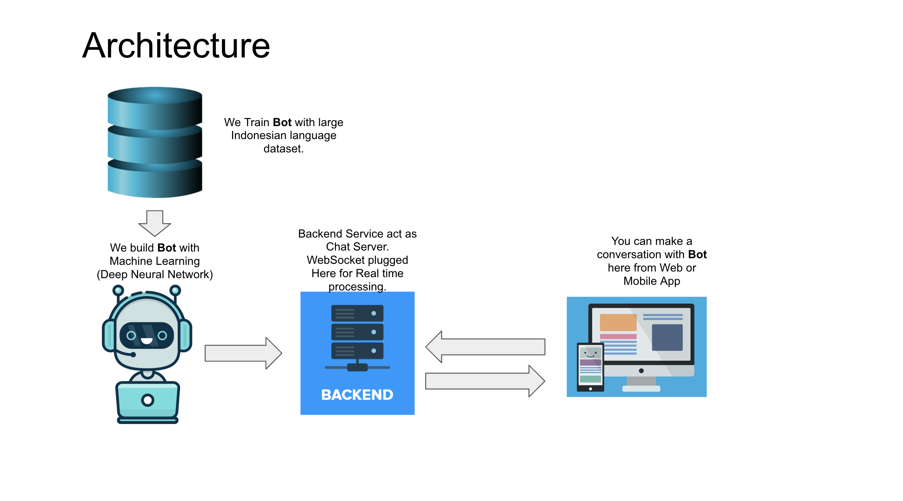

### Chatbot Core

Machine Learning Deep Neural Network Chatbot 

Artificial Neural Network

[](https://github.com/wuriyanto48/chatbot)
<br/><br/>

Architecture of this Bot

[](https://github.com/wuriyanto48/chatbot)
<br/><br/>

Requirements:

- Python 3.7 or Higher
- Virtualenv
- Nodejs

#### Getting started

Install virtualenv
```shell
$ pip install virtualenv 
```

Create virtualenv
```shell
$ virtualenv env -p python3 --no-site-packages
```

Activate virtualenv
```shell
$ source env/bin/activate
```

Install requirements 
```shell
$ pip install -r requirements.txt
```

#### Run Trainer

```shell
$ ./train_bot.py
```

### Run App

Thera are 3 interface for communicate with `Bot`

<b>CLI App</b>

```shell
$ ./cli_bot.py
```

<b>GUI App</b>

```shell
$ ./app_gui.py
```

<b>Restful API</b>

Run `Bot` first

```shell
$ ./app.py
```

Then run  `chat-server`
```shell
$ cd chat-server
$ npm start
```

#### Docker

Build image
```shell
$ make build
```

#
Wuriyanto 2020